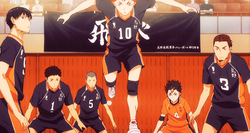
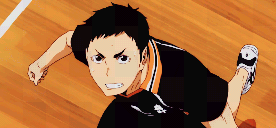

<center>
    <h1>Haikyuu!! 🏐</h1>
</center>

<center>

</center>

## 📚 Sinopse e Introdução ao Anime

Hinata Shoyo é um garoto do Ensino Médio que tem como sonho se tornar um jogador de vôlei profissional. Entretanto, por ter uma altura abaixo da média ele precisa desenvolver técnicas para conseguir atravessar a rede, uma grande muralha para ele, e lutar e se dedicar pela vitória nos jogos.

Em seu primeiro torneio escolar, Hinata e seus amigos perdem para o "Rei da Corte", Kageyama Tobio, e Hinata decide que irá superá-lo e derrota-lo. Mas, por ironia do destino, os dois se tornam companheiros de time e desenvolvem juntos técnicas incríveis e uma amizade forte.

Haikyuu é um anime que nos ensina que o esforço e a dedicação podem superar qualquer técnica e que todos em um time se tornam um só.

## 🐱‍👤 Personagens Principais

<div style="display: flex; justify-content: space-between;">
  
  

  

</div>

<h3> Shoyo Hinata</h3>

```
{
  "Posição": "Central",
  "Altura": 162.8cm,
  "Conhecido como": "O melhor Chafariz"
}
```

<p style="margin-top: 30px;">Shoyo Hinata, protagonista de Haikyuu!!, é um estudante do primeiro ano no Colégio Karasuno e um bloqueador central no time de vôlei. Com 162.8cm, é a segunda pessoa mais baixa da equipe, mas compensa sua estatura com habilidades de salto. Seu sonho é superar bloqueadores altos, inspirado pelo Pequeno Gigante, e após se formar, treina vôlei de praia no Brasil por dois anos. Ao retornar ao Japão, junta-se ao time MSBY Black Jackals na 1ª divisão da Liga V. Hinata é conhecido por sua personalidade animada e energética, sendo simplista e observador. Apesar de sua natureza extrovertida, demonstra seriedade e coragem no vôlei, revelando uma intensa paixão pelo esporte. </p>

<div style="display: flex; justify-content: space-between;">

  

  

</div>

<h3> Tobio Kageyama</h3>

```
{
  "Posição": "Levantador",
  "Altura": 180.6 cm,
  "Conhecido como": "O Rei da Quadra"
}
```

<p style="margin-top: 30px;">Tobio Kageyama é o levantador titular do time de vôlei masculino da escola Karasuno, conhecido por sua altura, olhar afiado e aura intimidadora. Inicialmente, ele era mal-humorado, arrogante e impaciente, apelidado de "O Rei da Quadra" devido ao seu autoritarismo. No entanto, por trás dessa fachada, Kageyama é mais sensível do que aparenta, incapaz de controlar sua frustração adequadamente. Após enfrentar o abandono de seus colegas, desenvolveu o medo de ser desprezado. Ao juntar-se à Karasuno, amadureceu, tornando-se mais respeitoso e compreendendo a importância do trabalho em equipe no vôlei, dedicando-se ao sucesso coletivo.</p>

<div style="display: flex; justify-content: space-between;">

  

  

</div>

<h3> Yu Nishinoya</h3>

```
{
  "Posição": "Líbero",
  "Altura": 160,5 cm,
  "Conhecido como": "O Guardião do Karasuno"
}
```

<p style="margin-top: 30px;">Yu Nishinoya, Líbero do time de vôlei da escola Karasuno, é um aluno do 2º ano e conhecido como o "Divino Guardião da Karasuno" pelos colegas de equipe. Sendo o mais baixo do time, ele destaca-se por seu cabelo despenteado e camisas com frases aleatórias. Apesar de sua estatura, Nishinoya é enérgico, temperamental e notável por suas peripécias malucas. Ele demonstra atenção aos sentimentos dos amigos, embora sua natureza impulsiva cause problemas. Nishinoya é tímido ao conversar com garotas desconhecidas, mas tem um interesse especial em Kiyoko Shimizu, compartilhado com Tanaka. Apesar de sua impaciência, ele se torna incrivelmente focado e sério durante os jogos, sendo admirado por sua habilidade e trabalho árduo, praticando continuamente para aprimorar suas habilidades. Seu passado revela que era um "grande gato assustado" quando criança, superando seus medos com a ajuda do avô, o que moldou sua tenacidade e coragem durante as partidas.</p>

<div style="display: flex; justify-content: space-between;">

  

  

</div>

<h3>Ryunosuke Tanaka</h3>

```
{
  "Posição": "Ponteiro",
  "Altura":  177,2cm,
  "Conhecido como": "O Veterano Favorito"
}
```

<p style="margin-top: 30px;">Ryunosuke Tanaka, atacante e ás em ascensão do clube de vôlei masculino da escola Karasuno, é aluno do segundo ano. Com a cabeça raspada, olhos azul-acinzentados (castanho nas ilustrações coloridas do mangá) e corpo musculoso, ele frequentemente é confundido com um delinquente devido à sua aparência intimidadora. No primeiro ano em Karasuno, seu cabelo era curto e bagunçado, tingido de loiro. Tanaka tem o hábito de fazer expressões ameaçadoras para assustar as pessoas, resultando em repreensões de Daichi.</p>

<div style="display: flex; justify-content: space-between;">


  
</div>

<h3>Asahi Azumane</h3>

```
{
  "Posição": "Ponteiro",
  "Altura":  186,4 cm,
  "Conhecido como": "O ACE DO KARASUNO"
}
```

<p style="margin-top: 30px;">Asahi Azumane, aluno do terceiro ano na escola Karasuno, desempenha o papel de ace no time de vôlei masculino da instituição. Com cabelos longos presos em um coque apertado, pouco acima dos ombros, e olhos castanhos escuros, Asahi apresenta uma imagem distinta. O uso de uma faixa complementa sua aparência, contribuindo para sua presença marcante como o principal jogador ofensivo do time de vôlei da Karasuno.</p>

<div style="display: flex; justify-content: space-between;">




  
</div>

<h3>Asahi Azumane</h3>

```
{
  "Posição": "Ponteiro",
  "Altura":  176.7 cm,
  "Conhecido como": "O Capitão"
}
```

<p style="margin-top: 30px;">Asahi Azumane, aluno do terceiro ano na escola Karasuno, desempenha o papel de ace no time de vôlei masculino da instituição. Com cabelos longos presos em um coque apertado, pouco acima dos ombros, e olhos castanhos escuros, Asahi apresenta uma imagem distinta. O uso de uma faixa complementa sua aparência, contribuindo para sua presença marcante como o principal jogador ofensivo do time de vôlei da Karasuno.</p>

<div style="display: flex; justify-content: space-between;">


  
</div>

<h3>Kei Tsukishima</h3>

```
{
  "Posição": "Central",
  "Altura":  188.3 cm,
  "Conhecido como": "Tsukki"
}
```

<p style="margin-top: 30px;">Kei Tsukishima, aluno do primeiro ano na escola Karasuno e bloqueador central no time de vôlei, é conhecido por sua altura notável de 188.3 centímetros, cabelos loiros e uma expressão frequentemente carrancuda. Vestindo o uniforme padrão do vôlei Karasuno durante as partidas, destaca-se por usar óculos esportivos graduados. Apesar de sua natureza antagônica e atitude presunçosa, Tsukishima revela baixa autoestima e uma considerável insegurança. Apesar de sua personalidade aparentemente desinteressada, ele tem uma paixão oculta pelo vôlei, intensificada após um confronto inspirador durante um treinamento em Tóquio. Seu crescimento no esporte é evidenciado pelo aprimoramento de suas habilidades e motivação, especialmente após bloquear Ushijima. Embora mantenha uma postura calma, Tsukishima usa a subestimação como motivação, e seu irmão Akiteru descreve-o como um menino trabalhador e gentil.</p>

<div style="display: flex; justify-content: space-between;">


  
</div>

<h3>Tadashi Yamaguchi</h3>

```
{
  "Posição": "Sacador Flutuante",
  "Altura":  180,0 cm,
  "Conhecido como": "Yamaguchi"
}
```

<p style="margin-top: 30px;">Tadashi Yamaguchi, aluno do primeiro ano no colégio Karasuno, é um garoto de aparência jovem com cabelos verde-acinzentados. Ingressando no time de vôlei Karasuno, veste o uniforme com o número 12 e demonstra um crescimento pessoal desde o ensino médio, superando as preocupações com sardas e magreza. Tímido e confiante nos outros, Yamaguchi tende a rir junto com Tsukishima ao zombar dos colegas. Sua personalidade esforçada é evidenciada pelo treino extra, buscando aprimorar seu saque e se tornar mais útil para a equipe. Após uma derrota impactante contra Aobajohsai High, ganha confiança com a ajuda dos colegas e Shimada, praticando o saque flutuante. Seu confronto corajoso com Tsukishima durante o acampamento de treinamento fortalece sua relação, impulsionando ambos a melhorar. Yamaguchi é um comunicador eficaz, construindo amizades sólidas e ganhando a confiança do time ao treinar o saque flutuante.</p>

## 🏐 Algumas Técnicas de Vôlei apresentadas

## 📺 Temporadas e Filmes

## 🤩 Motivo de escolha do Anime
