<center>
    <h1>Haikyuu!! 🏐</h1>
</center>

<center>

</center>


- [📝Índice](#índice)
- [📚 Sinopse e Introdução ao Anime](#-sinopse-e-introdução-ao-anime)
- [🐱‍👤 Personagens Principais](#-personagens-principais)
- [🏐 Algumas Técnicas de Vôlei apresentadas](#-algumas-técnicas-de-vôlei-apresentadas)
  - [1. Synchronized Attack](#1-synchronized-attack)
  - [2. Setter Dump](#2-setter-dump)
  - [3. Quick Attack](#3-quick-attack)
- [📺 Temporadas e Filmes](#-temporadas-e-filmes)
  - [Temporada 1](#temporada-1)
  - [Temporada 2](#temporada-2)
  - [Temporada 3](#temporada-3)
  - [Temporada 4](#temporada-4)
  - [Primeiro filme](#primeiro-filme)
  - [Segundo filme (FINAL)](#segundo-filme-final)
- [🤩 Motivo de escolha do Anime](#-motivo-de-escolha-do-anime)

## 📚 Sinopse e Introdução ao Anime

Hinata Shoyo é um garoto do Ensino Médio que tem como sonho se tornar um jogador de vôlei profissional. Entretanto, por ter uma altura abaixo da média ele precisa desenvolver técnicas para conseguir atravessar a rede, uma grande muralha para ele, e lutar e se dedicar pela vitória nos jogos.

Em seu primeiro torneio escolar, Hinata e seus amigos perdem para o "Rei da Corte", Kageyama Tobio, e Hinata decide que irá superá-lo e derrota-lo. Mas, por ironia do destino, os dois se tornam companheiros de time e desenvolvem juntos técnicas incríveis e uma amizade forte.

Haikyuu é um anime que nos ensina que o esforço e a dedicação podem superar qualquer técnica e que todos em um time se tornam um só.

## 🐱‍👤 Personagens Principais

<div style="display: flex; justify-content: center;">
  
  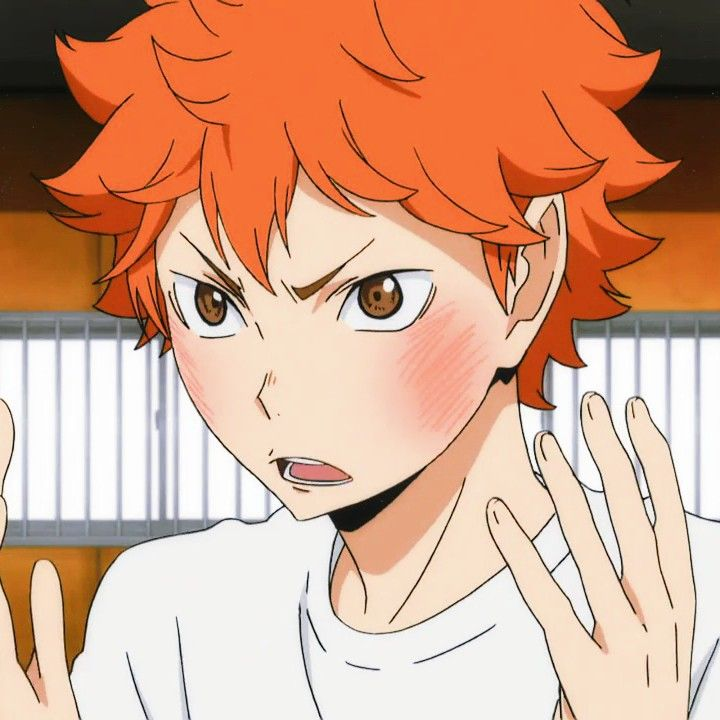

  

</div>

<h3> Shoyo Hinata</h3>

```
{
  "Posição": "Central",
  "Altura": 162.8cm,
  "Conhecido como": "O melhor Chafariz"
}
```

<p style="margin-top: 30px;">Shoyo Hinata, protagonista de Haikyuu!!, é um estudante do primeiro ano no Colégio Karasuno e um bloqueador central no time de vôlei. Com 162.8cm, é a segunda pessoa mais baixa da equipe, mas compensa sua estatura com habilidades de salto. Seu sonho é superar bloqueadores altos, inspirado pelo Pequeno Gigante, e após se formar, treina vôlei de praia no Brasil por dois anos. Ao retornar ao Japão, junta-se ao time MSBY Black Jackals na 1ª divisão da Liga V. Hinata é conhecido por sua personalidade animada e energética, sendo simplista e observador. Apesar de sua natureza extrovertida, demonstra seriedade e coragem no vôlei, revelando uma intensa paixão pelo esporte. </p>

<div style="display: flex; justify-content: center;">

  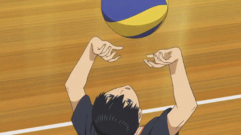

  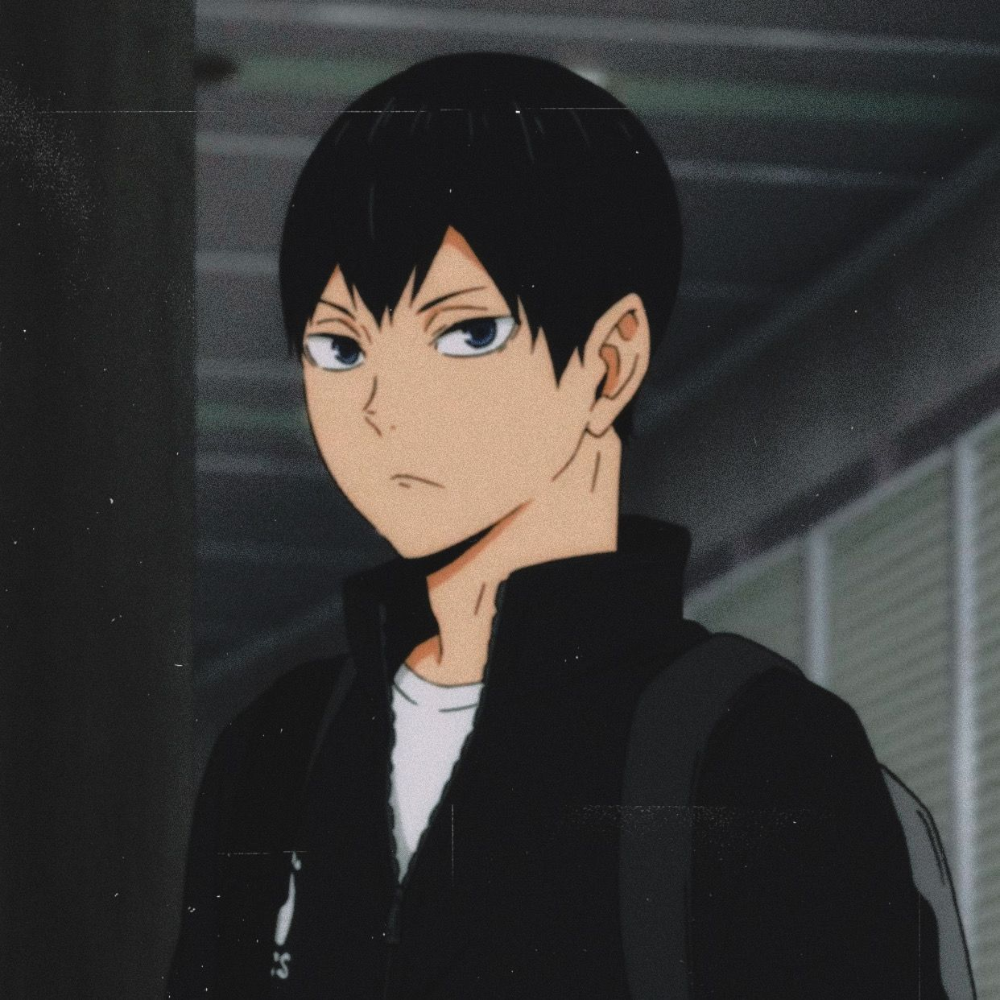

</div>

<h3> Tobio Kageyama</h3>

```
{
  "Posição": "Levantador",
  "Altura": 180.6 cm,
  "Conhecido como": "O Rei da Quadra"
}
```

<p style="margin-top: 30px;">Tobio Kageyama é o levantador titular do time de vôlei masculino da escola Karasuno, conhecido por sua altura, olhar afiado e aura intimidadora. Inicialmente, ele era mal-humorado, arrogante e impaciente, apelidado de "O Rei da Quadra" devido ao seu autoritarismo. No entanto, por trás dessa fachada, Kageyama é mais sensível do que aparenta, incapaz de controlar sua frustração adequadamente. Após enfrentar o abandono de seus colegas, desenvolveu o medo de ser desprezado. Ao juntar-se à Karasuno, amadureceu, tornando-se mais respeitoso e compreendendo a importância do trabalho em equipe no vôlei, dedicando-se ao sucesso coletivo.</p>

<div style="display: flex; justify-content: center;">

  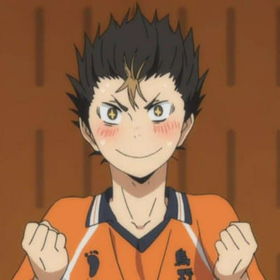

  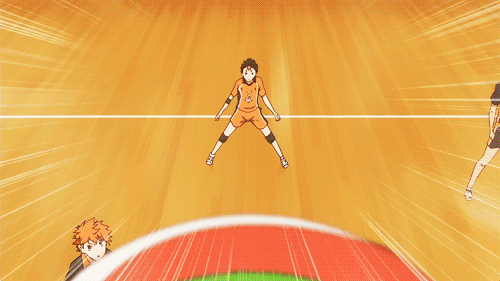

</div>

<h3> Yu Nishinoya</h3>

```
{
  "Posição": "Líbero",
  "Altura": 160,5 cm,
  "Conhecido como": "O Guardião do Karasuno"
}
```

<p style="margin-top: 30px;">Yu Nishinoya, Líbero do time de vôlei da escola Karasuno, é um aluno do 2º ano e conhecido como o "Divino Guardião da Karasuno" pelos colegas de equipe. Sendo o mais baixo do time, ele destaca-se por seu cabelo despenteado e camisas com frases aleatórias. Apesar de sua estatura, Nishinoya é enérgico, temperamental e notável por suas peripécias malucas. Ele demonstra atenção aos sentimentos dos amigos, embora sua natureza impulsiva cause problemas. Nishinoya é tímido ao conversar com garotas desconhecidas, mas tem um interesse especial em Kiyoko Shimizu, compartilhado com Tanaka. Apesar de sua impaciência, ele se torna incrivelmente focado e sério durante os jogos, sendo admirado por sua habilidade e trabalho árduo, praticando continuamente para aprimorar suas habilidades. Seu passado revela que era um "grande gato assustado" quando criança, superando seus medos com a ajuda do avô, o que moldou sua tenacidade e coragem durante as partidas.</p>

<div style="display: flex; justify-content: center;">

  

  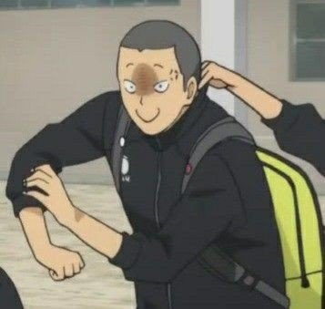

</div>

<h3>Ryunosuke Tanaka</h3>

```
{
  "Posição": "Ponteiro",
  "Altura":  177,2cm,
  "Conhecido como": "O Veterano Favorito"
}
```

<p style="margin-top: 30px;">Ryunosuke Tanaka, atacante e ás em ascensão do clube de vôlei masculino da escola Karasuno, é aluno do segundo ano. Com a cabeça raspada, olhos azul-acinzentados (castanho nas ilustrações coloridas do mangá) e corpo musculoso, ele frequentemente é confundido com um delinquente devido à sua aparência intimidadora. No primeiro ano em Karasuno, seu cabelo era curto e bagunçado, tingido de loiro. Tanaka tem o hábito de fazer expressões ameaçadoras para assustar as pessoas, resultando em repreensões de Daichi.</p>

<div style="display: flex; justify-content: center;">

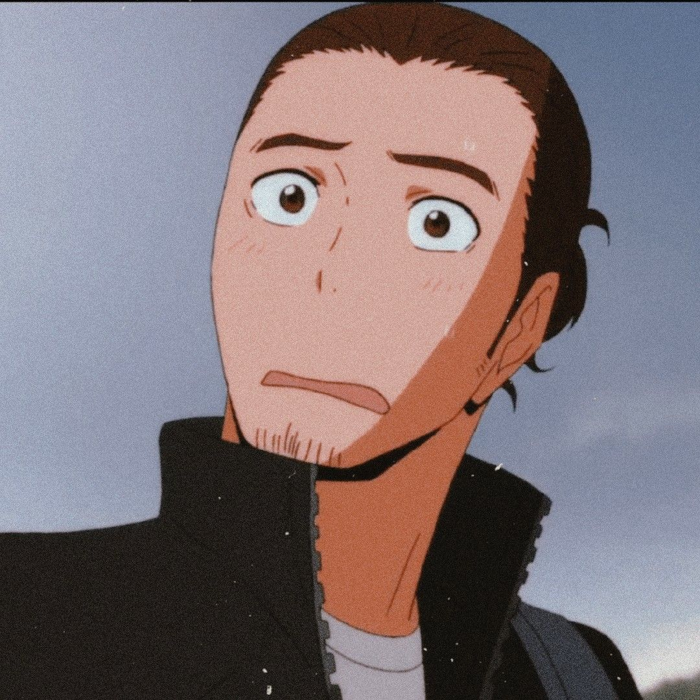


  
</div>

<h3>Asahi Azumane</h3>

```
{
  "Posição": "Ponteiro",
  "Altura":  186,4 cm,
  "Conhecido como": "O ACE DO KARASUNO"
}
```

<p style="margin-top: 30px;">Asahi Azumane, aluno do terceiro ano na escola Karasuno, desempenha o papel de ace no time de vôlei masculino da instituição. Com cabelos longos presos em um coque apertado, pouco acima dos ombros, e olhos castanhos escuros, Asahi apresenta uma imagem distinta. O uso de uma faixa complementa sua aparência, contribuindo para sua presença marcante como o principal jogador ofensivo do time de vôlei da Karasuno.</p>

<div style="display: flex; justify-content: center;">


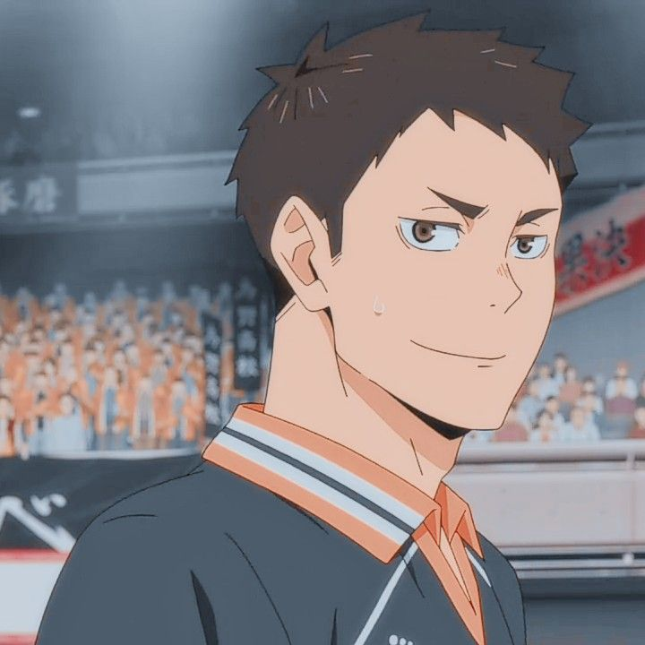
  
</div>

<h3>Daichi Sawamura</h3>

```
{
  "Posição": "Ponteiro",
  "Altura":  176.7 cm,
  "Conhecido como": "O Capitão"
}
```

<p style="margin-top: 30px;">Daichi Sawamura, aluno do terceiro ano na escola Karasuno, ocupa o papel de Capitão e Atacante de Ponta no time de vôlei masculino da instituição. Durante a ausência do técnico Ukai devido a hospitalização, Daichi assumiu o papel de liderança como um dos capitães e temporariamente desempenhou funções de treinador. Possuindo cabelos curtos e escuros, olhos castanhos escuros e uma presença reconfortante, Daichi não é considerado alto, mas exibe massa muscular. Reconhecido por sua recepção sólida, ele é especialista defensivo e frequentemente lida com recebimentos desafiadores, além de cobrir os erros dos companheiros de equipe. Seu conhecimento do jogo, adquirido ao aprender táticas por conta própria durante o primeiro ano devido à falta de treinador, destaca-se. Após o Arco da Expedição de Tóquio, Daichi aprimorou ainda mais suas habilidades defensivas e ganhou a capacidade de visualizar os movimentos do adversário com mais clareza, inclusive utilizando a forma do cravo adversário para antecipar trajetórias de ataques.</p>

<div style="display: flex; justify-content: center;">

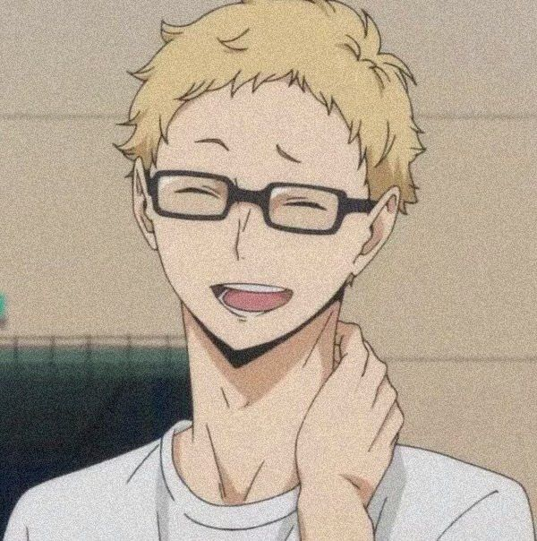

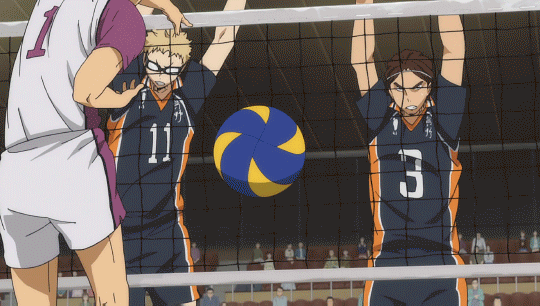
  
</div>

<h3>Kei Tsukishima</h3>

```
{
  "Posição": "Central",
  "Altura":  188.3 cm,
  "Conhecido como": "Tsukki"
}
```

<p style="margin-top: 30px;">Kei Tsukishima, aluno do primeiro ano na escola Karasuno e bloqueador central no time de vôlei, é conhecido por sua altura notável de 188.3 centímetros, cabelos loiros e uma expressão frequentemente carrancuda. Vestindo o uniforme padrão do vôlei Karasuno durante as partidas, destaca-se por usar óculos esportivos graduados. Apesar de sua natureza antagônica e atitude presunçosa, Tsukishima revela baixa autoestima e uma considerável insegurança. Apesar de sua personalidade aparentemente desinteressada, ele tem uma paixão oculta pelo vôlei, intensificada após um confronto inspirador durante um treinamento em Tóquio. Seu crescimento no esporte é evidenciado pelo aprimoramento de suas habilidades e motivação, especialmente após bloquear Ushijima. Embora mantenha uma postura calma, Tsukishima usa a subestimação como motivação, e seu irmão Akiteru descreve-o como um menino trabalhador e gentil.</p>

<div style="display: flex; justify-content: center;">
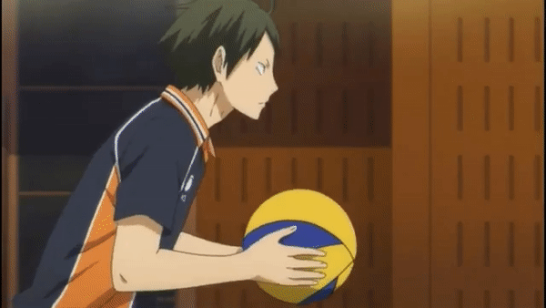

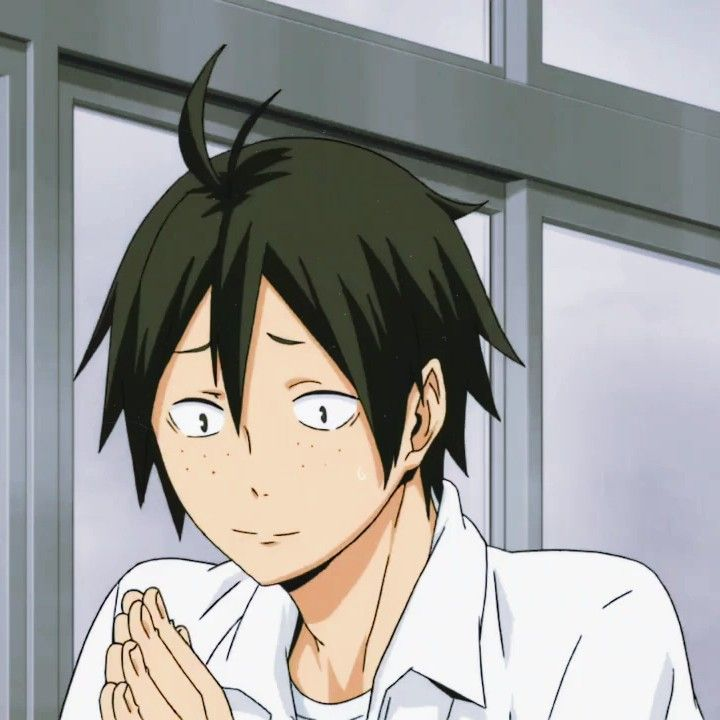

</div>

<h3>Tadashi Yamaguchi</h3>

```
{
  "Posição": "Sacador Flutuante",
  "Altura":  180,0 cm,
  "Conhecido como": "Yamaguchi"
}
```

<p style="margin-top: 30px;">Tadashi Yamaguchi, aluno do primeiro ano no colégio Karasuno, é um garoto de aparência jovem com cabelos verde-acinzentados. Ingressando no time de vôlei Karasuno, veste o uniforme com o número 12 e demonstra um crescimento pessoal desde o ensino médio, superando as preocupações com sardas e magreza. Tímido e confiante nos outros, Yamaguchi tende a rir junto com Tsukishima ao zombar dos colegas. Sua personalidade esforçada é evidenciada pelo treino extra, buscando aprimorar seu saque e se tornar mais útil para a equipe. Após uma derrota impactante contra Aobajohsai High, ganha confiança com a ajuda dos colegas e Shimada, praticando o saque flutuante. Seu confronto corajoso com Tsukishima durante o acampamento de treinamento fortalece sua relação, impulsionando ambos a melhorar. Yamaguchi é um comunicador eficaz, construindo amizades sólidas e ganhando a confiança do time ao treinar o saque flutuante.</p>

## 🏐 Algumas Técnicas de Vôlei apresentadas
Ao decorrer do anime são apresentadas algumas estratégias de vôlei que até mesmo foram utilizadas diversos times profissionais de volêi que serviram como inspiração. Dentre elas, destacam-se:

### 1. Synchronized Attack
<center>
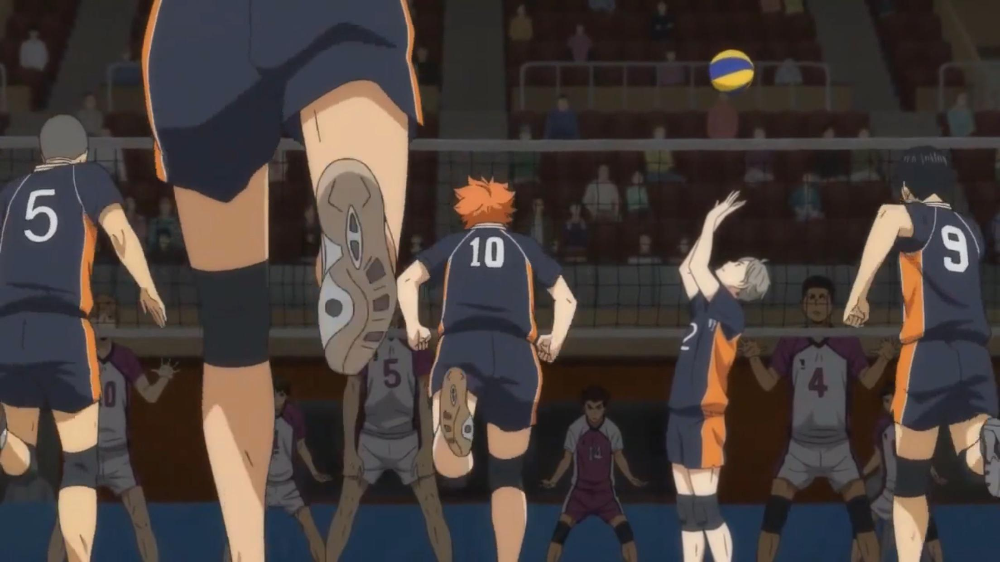
</center>

O ataque sincronizado, ou "synchronized attack" em inglês, é uma técnica que envolve uma coordenação precisa entre os jogadores para criar um ataque eficaz. No contexto de Haikyuu!!, o ataque sincronizado é frequentemente representado pelos conjuntos bem coordenados de Kageyama e os ataques precisos de seus companheiros de equipe, especialmente Hinata. O rápido entendimento e sincronia entre o levantador e os atacantes são essenciais para a execução bem-sucedida dessa técnica. Isso reflete a importância da comunicação e trabalho em equipe no vôlei profissional, onde ataques sincronizados podem superar a defesa adversária de maneira eficiente.

Aqui está um exemplo da equipe da seleção Japonesa realizando essa estratégia: [Youtube Video](https://youtu.be/N_YuIoocBvo?si=W7BjwkRZWiDVuDWa).

### 2. Setter Dump

<center>
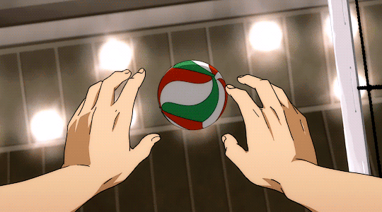
</center>

O "setter dump" é uma estratégia tática em que o levantador finge que vai realizar uma jogada normal, mas em vez disso, ele decide manter a bola e tenta marcar um ponto surpreendendo a defesa contrária. Essa jogada é eficaz quando o adversário não está preparado para a rápida mudança na tática.

Aqui está um exemplo executado pelo Bruno Rezende na seleção brasileira aos ```0:59``` do vídeo [Youtube Video](https://youtu.be/ruhrPRucIAs?si=GonwKRJ-iN7O0eTD&t=56).

### 3. Quick Attack

<center>

</center>

O "Quick Attack" é uma técnica de voleibol destacada em Haikyuu!! pelo conjunto dinâmico entre Tobio Kageyama e Shoyo Hinata. Envolve um rápido e eficiente entendimento entre o levantador e o atacante, surpreendendo a defesa adversária. Hinata, conhecido por sua agilidade, ataca a bola enquanto ainda está subindo para a rede, pegando os oponentes desprevenidos e reduzindo o tempo de reação da defesa. Essa jogada é uma arma estratégica para ganhar pontos rapidamente, capitalizando a velocidade e habilidades individuais dos jogadores envolvidos. Em Haikyuu!!, Kageyama e Hinata aprimoram essa técnica com o "Freak Quick", uma variação emocionante.

Aqui está uma variação executada pelo Flávio e o Fernando da seleção brasileira aos ```0:17``` do vídeo [Youtube Video](https://youtu.be/29BMd8cuBsg?si=ZvWqPMDf4kCEM1kK)

Ao decorrer do anime são apresentadas algumas estratégias de vôlei que até mesmo foram utilizadas diversos times profissionais de volêi que serviram como inspiração. Dentre elas, destacam-se:

### 1. Synchronized Attack

<center>

</center>

O ataque sincronizado, ou "synchronized attack" em inglês, é uma técnica que envolve uma coordenação precisa entre os jogadores para criar um ataque eficaz. No contexto de Haikyuu!!, o ataque sincronizado é frequentemente representado pelos conjuntos bem coordenados de Kageyama e os ataques precisos de seus companheiros de equipe, especialmente Hinata. O rápido entendimento e sincronia entre o levantador e os atacantes são essenciais para a execução bem-sucedida dessa técnica. Isso reflete a importância da comunicação e trabalho em equipe no vôlei profissional, onde ataques sincronizados podem superar a defesa adversária de maneira eficiente.

Aqui está um exemplo da equipe da seleção Japonesa realizando essa estratégia: [Youtube Video](https://youtu.be/N_YuIoocBvo?si=W7BjwkRZWiDVuDWa).

### 2. Setter Dump

<center>

</center>

O "setter dump" é uma estratégia tática em que o levantador finge que vai realizar uma jogada normal, mas em vez disso, ele decide manter a bola e tenta marcar um ponto surpreendendo a defesa contrária. Essa jogada é eficaz quando o adversário não está preparado para a rápida mudança na tática.

Aqui está um exemplo executado pelo Bruno Rezende na seleção brasileira aos `0:59` do vídeo [Youtube Video](https://youtu.be/ruhrPRucIAs?si=GonwKRJ-iN7O0eTD&t=56).

### 3. Quick Attack

<center>

</center>

O "Quick Attack" é uma técnica de voleibol destacada em Haikyuu!! pelo conjunto dinâmico entre Tobio Kageyama e Shoyo Hinata. Envolve um rápido e eficiente entendimento entre o levantador e o atacante, surpreendendo a defesa adversária. Hinata, conhecido por sua agilidade, ataca a bola enquanto ainda está subindo para a rede, pegando os oponentes desprevenidos e reduzindo o tempo de reação da defesa. Essa jogada é uma arma estratégica para ganhar pontos rapidamente, capitalizando a velocidade e habilidades individuais dos jogadores envolvidos. Em Haikyuu!!, Kageyama e Hinata aprimoram essa técnica com o "Freak Quick", uma variação emocionante.

Aqui está uma variação executada pelo Flávio e o Fernando da seleção brasileira aos `0:17` do vídeo [Youtube Video](https://youtu.be/29BMd8cuBsg?si=ZvWqPMDf4kCEM1kK)

## 📺 Temporadas e Filmes

### Temporada 1

<div style="display: flex; justify-content: center;">

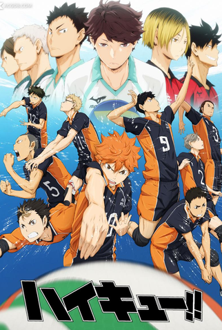

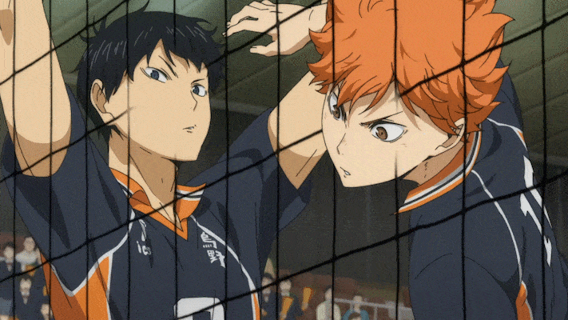

</div>
<p>
<div>
A primeira temporada desenrola a turbulenta relação entre Hinata e Kageyama, enquanto a equipe Karasuno se esforça para se destacar em meio a escolas rivais de voleibol de elite. Com treinamentos intensos, jogos eletrizantes e rivalidades acirradas, os membros do time Karasuno aprendem a confiar uns nos outros, descobrindo o verdadeiro significado do trabalho em equipe e da superação pessoal. A temporada gira em torno de um torneio intercolegial, em que a determinação de Hinata e seus companheiros é posta à prova diante de desafios formidáveis, preparando o terreno para futuros confrontos emocionantes.
</div>
</p>

### Temporada 2

<div style="display: flex; justify-content: center;">

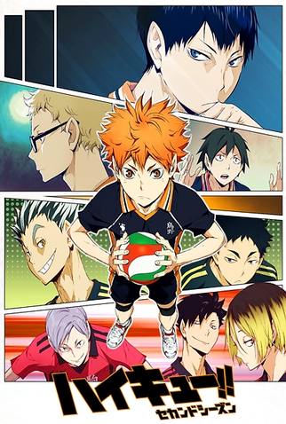

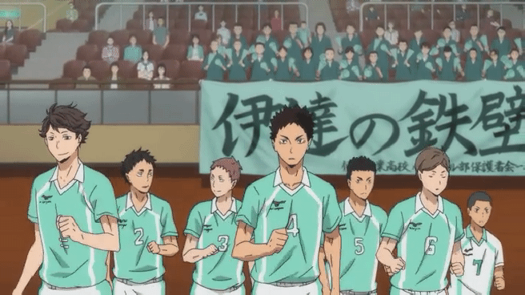

</div>
<p>
<div>
Na segunda temporada, a equipe Karasuno, agora mais determinada do que nunca, continua sua jornada no mundo competitivo do vôlei. O foco central recai sobre o Torneio de Primavera, um evento onde as melhores equipes da região se enfrentam em uma competição acirrada. O entrosamento aprimorado entre Shoyo Hinata e Tobio Kageyama se torna a chave para o sucesso do time, enquanto eles enfrentam desafios ainda mais formidáveis e equipes adversárias cada vez mais talentosas.

Ao longo da temporada, novos personagens são introduzidos, como a equipe formidável Aoba Johsai High School, liderada pelo talentoso setter Tooru Oikawa. A Aoba Johsai é conhecida por sua habilidade técnica refinada e pela capacidade de Oikawa de orquestrar jogadas incríveis. A rivalidade entre as equipes atinge um novo patamar, criando confrontos intensos e momentos emocionantes em quadra e para o espectador.

</div>
</p>

### Temporada 3

<div style="display: flex; justify-content: center;">

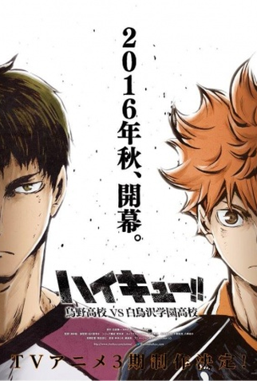

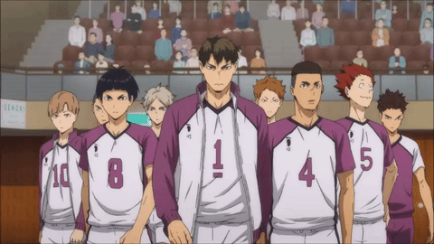

</div>
<p>
<div>
Na terceira temporada, Karasuno enfrenta seu desafio mais formidável até o momento ao se deparar com a poderosa equipe da Academia Shiratorizawa. Sob a liderança do implacável Ushijima Wakatoshi, Shiratorizawa é conhecida por sua força física avassaladora e pela habilidade singular de Ushijima como um atacante excepcional.

A temporada se concentra no aguardado Torneio de Outono, onde as equipes de voleibol colegial competem pelo título regional. Karasuno, determinada a superar seus limites, encara Shiratorizawa nas eliminatórias, dando início a um confronto épico. A equipe de Karasuno, liderada por Shoyo Hinata e Tobio Kageyama, busca superar as expectativas e provar que podem competir no mais alto nível.

A rivalidade entre Karasuno e Shiratorizawa é intensificada por uma atmosfera tensa e partidas emocionantes, levando os jogadores ao limite de suas habilidades. Além do desafio em quadra, a temporada explora os esforços da equipe Karasuno para compreender e superar as estratégias únicas de Shiratorizawa, bem como o desenvolvimento dos personagens enquanto enfrentam um adversário tão formidável.

A 3ª temporada de "Haikyuu!!" é repleta de momentos dramáticos e reviravoltas emocionantes.

</div>
</p>

### Temporada 4

<div style="display: flex; justify-content: center;">

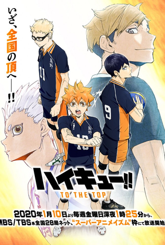

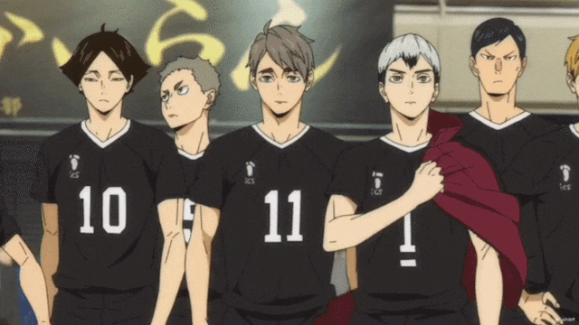

</div>
<p>
<div>

Na quarta temporada, Karasuno enfrenta novos desafios e adversários enquanto continua sua jornada no competitivo mundo do voleibol colegial. O foco principal recai sobre o Torneio Nacional, onde as melhores equipes do país se encontram para competir em uma batalha feroz.

Durante a temporada, Karasuno se depara com a talentosa e estratégica equipe da Escola Secundária Inarizaki, liderada pelos habilidosos irmãos gêmeos Atsumu e Osamu Miya. Os Miya são conhecidos por suas jogadas sincronizadas e táticas imprevisíveis, proporcionando uma competição acirrada e inovadora para Karasuno.

Além de Inarizaki, a jornada de Karasuno no Torneio Nacional envolve encontros com outras equipes notáveis, como a Escola Secundária Tsubakihara e a Escola Secundária Kamomedai. Cada equipe traz seu próprio conjunto de desafios únicos, testando a determinação, habilidade e trabalho em equipe de Karasuno.

A busca de Karasuno pelo título nacional é repleta de emoções, surpresas e lições valiosas, solidificando ainda mais a reputação da série como uma obra-prima do gênero esportivo.

</div>
</p>

### Primeiro filme

<div style="display: flex; justify-content: center;">

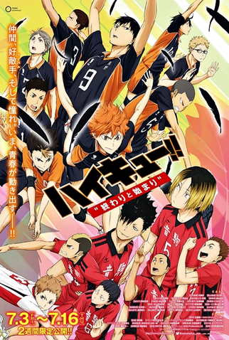

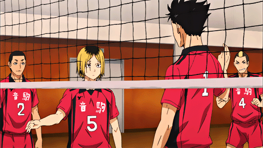

</div>
<p>
<div>

No primeiro filme, intitulado "Haikyuu!!: A Batalha dos Corvos", a história se concentra em um dos confrontos mais esperados do mundo do voleibol colegial: Karasuno contra Nekoma. A rivalidade entre essas duas equipes atinge o ápice quando são colocadas frente a frente em um torneio crucial.

Enquanto a equipe Karasuno, liderada por Shoyo Hinata e Tobio Kageyama, busca afirmar seu lugar entre as melhores, a Nekoma High School, comandada pelo estrategista Tetsuro Kuroo, está determinada a provar que são a equipe mais forte e inteligente em quadra. O filme mergulha nos bastidores das duas equipes, explorando suas motivações, táticas e a profunda amizade entre os jogadores.

</div>
</p>

### Segundo filme (FINAL)

<p style="text-align: center;">
  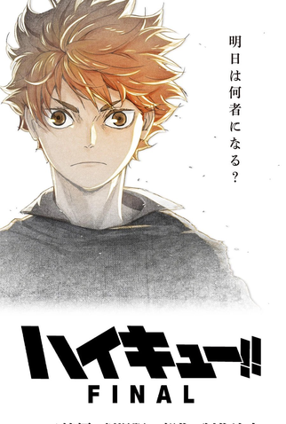
</p>

<p>
<div>

O último filme de Haikyuu deve mostrar o final da trama, apesar de não ter muitos detalhes, acredita-se que ele será lançado ao final de 2024 e mostrará o futuro da batalha de Karasuno e do destino dos parceiros Hinata e Kageyama no mundo do vôlei.

</div>
</p>

## 🤩 Motivo de escolha do Anime

A príncipio escolhemos esse anime como tema do nosso readme pois é um que nos temos em comum e simpatizamos bastante, além de que a história de cada personagem é única e o desenvolvimento de cada um tem sua interferência positiva principalmente no trabalho em equipe.
